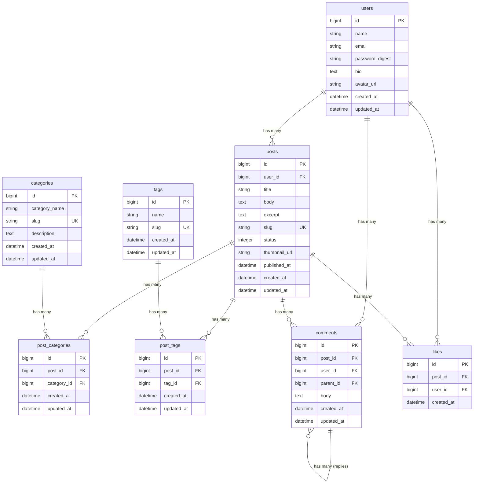

# データベース設計

## ER図



## テーブル定義

### users（ユーザー）

| カラム名 | 型 | NULL | デフォルト | 説明 |
|---|---|---|---|---|
| id | bigint | NOT NULL | AUTO_INCREMENT | PK |
| name | varchar(255) | NOT NULL | - | 表示名 |
| email | varchar(255) | NOT NULL | - | メールアドレス（一意） |
| password_digest | varchar(255) | NOT NULL | - | bcryptハッシュ |
| bio | text | NULL | - | 自己紹介 |
| avatar_url | varchar(255) | NULL | - | アバター画像URL |
| created_at | datetime | NOT NULL | - | 作成日時 |
| updated_at | datetime | NOT NULL | - | 更新日時 |

**インデックス**
- `UNIQUE INDEX idx_users_email (email)`

---

### posts（記事）

| カラム名 | 型 | NULL | デフォルト | 説明 |
|---|---|---|---|---|
| id | bigint | NOT NULL | AUTO_INCREMENT | PK |
| user_id | bigint | NOT NULL | - | FK → users.id |
| title | varchar(255) | NOT NULL | - | 記事タイトル |
| body | text | NOT NULL | - | 本文（Markdown可） |
| excerpt | text | NULL | - | 抜粋（一覧表示用） |
| slug | varchar(255) | NOT NULL | - | URLスラッグ（一意） |
| status | int | NOT NULL | 0 | 0=draft, 1=published, 2=archived |
| thumbnail_url | varchar(255) | NULL | - | サムネイル画像URL |
| published_at | datetime | NULL | - | 公開日時 |
| created_at | datetime | NOT NULL | - | 作成日時 |
| updated_at | datetime | NOT NULL | - | 更新日時 |

**ステータス定義**
```ruby
enum status: { draft: 0, published: 1, archived: 2 }
```

**インデックス**
- `UNIQUE INDEX idx_posts_slug (slug)`
- `INDEX idx_posts_user_id (user_id)`
- `INDEX idx_posts_status (status)`
- `INDEX idx_posts_published_at (published_at)`

---

### categories（カテゴリ）

| カラム名 | 型 | NULL | デフォルト | 説明 |
|---|---|---|---|---|
| id | bigint | NOT NULL | AUTO_INCREMENT | PK |
| category_name | varchar(255) | NOT NULL | - | カテゴリ名 |
| slug | varchar(255) | NOT NULL | - | URLスラッグ（一意） |
| description | text | NULL | - | 説明 |
| created_at | datetime | NOT NULL | - | 作成日時 |
| updated_at | datetime | NOT NULL | - | 更新日時 |

**インデックス**
- `UNIQUE INDEX idx_categories_slug (slug)`

---

### tags（タグ）

| カラム名 | 型 | NULL | デフォルト | 説明 |
|---|---|---|---|---|
| id | bigint | NOT NULL | AUTO_INCREMENT | PK |
| name | varchar(100) | NOT NULL | - | タグ名 |
| slug | varchar(100) | NOT NULL | - | URLスラッグ（一意） |
| created_at | datetime | NOT NULL | - | 作成日時 |
| updated_at | datetime | NOT NULL | - | 更新日時 |

**インデックス**
- `UNIQUE INDEX idx_tags_slug (slug)`

---

### post_categories（記事↔カテゴリ 中間テーブル）

| カラム名 | 型 | NULL | デフォルト | 説明 |
|---|---|---|---|---|
| id | bigint | NOT NULL | AUTO_INCREMENT | PK |
| post_id | bigint | NOT NULL | - | FK → posts.id |
| category_id | bigint | NOT NULL | - | FK → categories.id |
| created_at | datetime | NOT NULL | - | 作成日時 |
| updated_at | datetime | NOT NULL | - | 更新日時 |

**インデックス**
- `UNIQUE INDEX idx_post_categories_post_category (post_id, category_id)`
- `INDEX idx_post_categories_category_id (category_id)`

---

### post_tags（記事↔タグ 中間テーブル）

| カラム名 | 型 | NULL | デフォルト | 説明 |
|---|---|---|---|---|
| id | bigint | NOT NULL | AUTO_INCREMENT | PK |
| post_id | bigint | NOT NULL | - | FK → posts.id |
| tag_id | bigint | NOT NULL | - | FK → tags.id |
| created_at | datetime | NOT NULL | - | 作成日時 |
| updated_at | datetime | NOT NULL | - | 更新日時 |

**インデックス**
- `UNIQUE INDEX idx_post_tags_post_tag (post_id, tag_id)`
- `INDEX idx_post_tags_tag_id (tag_id)`

---

### comments（コメント）

| カラム名 | 型 | NULL | デフォルト | 説明 |
|---|---|---|---|---|
| id | bigint | NOT NULL | AUTO_INCREMENT | PK |
| post_id | bigint | NOT NULL | - | FK → posts.id |
| user_id | bigint | NOT NULL | - | FK → users.id |
| parent_id | bigint | NULL | - | FK → comments.id（返信時） |
| body | text | NOT NULL | - | コメント本文 |
| created_at | datetime | NOT NULL | - | 作成日時 |
| updated_at | datetime | NOT NULL | - | 更新日時 |

**インデックス**
- `INDEX idx_comments_post_id (post_id)`
- `INDEX idx_comments_user_id (user_id)`
- `INDEX idx_comments_parent_id (parent_id)`

---

### likes（いいね）

| カラム名 | 型 | NULL | デフォルト | 説明 |
|---|---|---|---|---|
| id | bigint | NOT NULL | AUTO_INCREMENT | PK |
| post_id | bigint | NOT NULL | - | FK → posts.id |
| user_id | bigint | NOT NULL | - | FK → users.id |
| created_at | datetime | NOT NULL | - | 作成日時 |

**インデックス**
- `UNIQUE INDEX idx_likes_post_user (post_id, user_id)`（1ユーザー1いいね制約）

---

## マイグレーション計画

既存のマイグレーションに対して、以下の追加マイグレーションが必要。

| 優先度 | マイグレーション | 内容 |
|---|---|---|
| 高 | add_user_id_to_posts | posts に user_id カラム追加 |
| 高 | add_slug_to_posts | posts に slug, published_at, excerpt, thumbnail_url 追加 |
| 高 | add_slug_to_categories | categories に slug, description 追加 |
| 高 | add_bio_to_users | users に bio, avatar_url 追加 |
| 中 | create_tags | tags テーブル作成 |
| 中 | create_post_categories | post_categories 中間テーブル作成 |
| 中 | create_post_tags | post_tags 中間テーブル作成 |
| 低 | create_comments | comments テーブル作成 |
| 低 | create_likes | likes テーブル作成 |

## モデルのアソシエーション

```ruby
# user.rb
class User < ApplicationRecord
  has_secure_password
  has_many :posts, dependent: :destroy
  has_many :comments, dependent: :destroy
  has_many :likes, dependent: :destroy
end

# post.rb
class Post < ApplicationRecord
  belongs_to :user
  has_many :post_categories, dependent: :destroy
  has_many :categories, through: :post_categories
  has_many :post_tags, dependent: :destroy
  has_many :tags, through: :post_tags
  has_many :comments, dependent: :destroy
  has_many :likes, dependent: :destroy

  enum status: { draft: 0, published: 1, archived: 2 }

  before_validation :generate_slug, on: :create
end

# comment.rb
class Comment < ApplicationRecord
  belongs_to :post
  belongs_to :user
  belongs_to :parent, class_name: 'Comment', optional: true
  has_many :replies, class_name: 'Comment', foreign_key: :parent_id, dependent: :destroy
end
```
